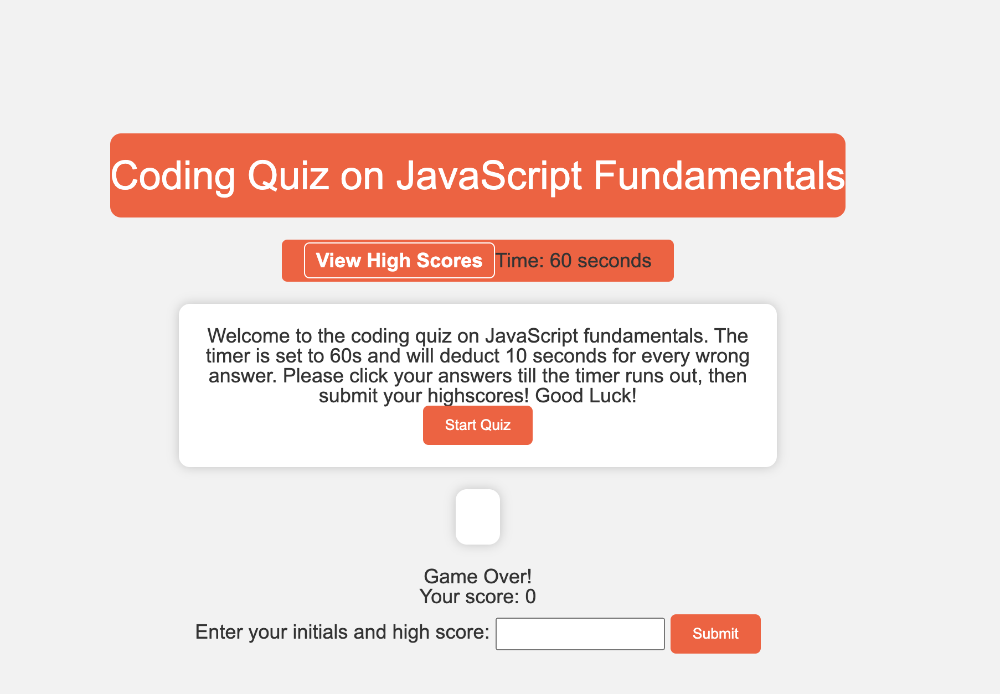
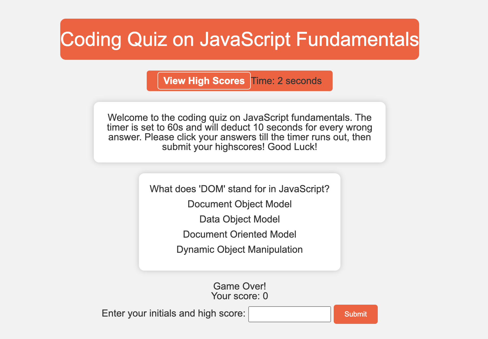
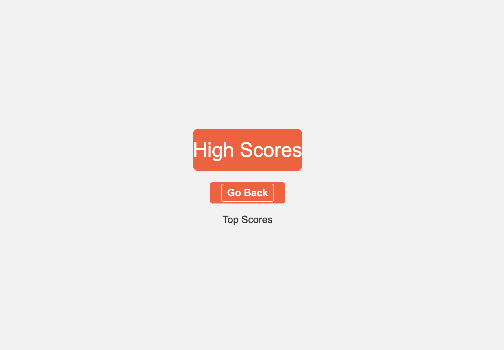

# Timed-Coding-Quiz

## Description

The motivation behind creating this JavaScript Coding Quiz was to offer an engaging and interactive way for individuals to test their knowledge of JavaScript fundamentals. JavaScript is a widely used programming language in web development, and having a solid understanding of its basics is crucial for aspiring developers. This quiz serves as an educational tool and a fun way to reinforce and assess one's JavaScript knowledge.

The primary goal of this project was to build an intuitive and accessible web application that can be easily used by individuals interested in learning JavaScript or assessing their existing knowledge. The project's purpose goes beyond being just a homework assignment; it aims to provide a practical and enjoyable learning experience for users.

This JavaScript Coding Quiz addresses several key objectives:

Assessment: It allows users to assess their understanding of JavaScript fundamentals by answering multiple-choice questions.

Learning: It serves as a learning tool, providing immediate feedback on the correctness of answers and explanations for incorrect choices.

Engagement: The inclusion of a timer and scoring system adds an element of competition and motivation to complete the quiz quickly and accurately.

High Scores: Users can submit their high scores, fostering a sense of achievement and competition among participants.

## Usage

Please find link to quiz here: https://mfmcnolt.github.io/timed_coding_quiz/

The JavaScript Coding Quiz is designed to be user-friendly and straightforward to use. Here are step-by-step instructions for using this quiz:

**1. Starting the Quiz:**

- Upon opening the web application, users will encounter a welcoming message and an inviting "Start Quiz" button. This button is prominently displayed in the center of the screen.

- To initiate the quiz, simply click on the "Start Quiz" button.

**2. Answering Questions:**

- Once the quiz starts, users will be presented with a series of multiple-choice questions, one at a time, along with a timer displaying the remaining time.

- Read each question carefully and click on the answer you believe is correct.

- If you choose the correct answer, you will move onto the next questions.

- If you select an incorrect answer, a time penalty of 10 seconds will be applied to your remaining time.

**3. Timer:**

- The timer, located at the top right corner, counts down from 60 seconds. For each incorrect answer, 10 seconds will be deducted.

- The quiz will automatically end when the timer reaches zero or when you complete all the questions.

**4. Quiz Completion:**

- After you have answered all the questions or the timer runs out, the quiz will conclude. Your initials and score needs to be added into the form.

**5. Submitting High Scores:**

- To submit your score to the high scores leaderboard, enter your initials in the provided field and click the "Submit" button.

**Additional Tips:**

- Pay attention to the timer. The quicker you answer correctly, the higher your score will be.

- Challenge yourself and try to achieve a perfect score!

By following these straightforward steps, users can easily navigate through the JavaScript Coding Quiz, test their JavaScript knowledge, and submit their high scores to compete with others. Enjoy the learning experience and have fun!

## Credits

N/A

## License

N/A

## Badges

N/A

## Features

- Multiple-choice questions on JavaScript fundamentals.
- Timer to track the time remaining.
- Score tracking.
- High score submission.
- High scores leaderboard.

## How to Contribute

N/A

## Tests

N/A